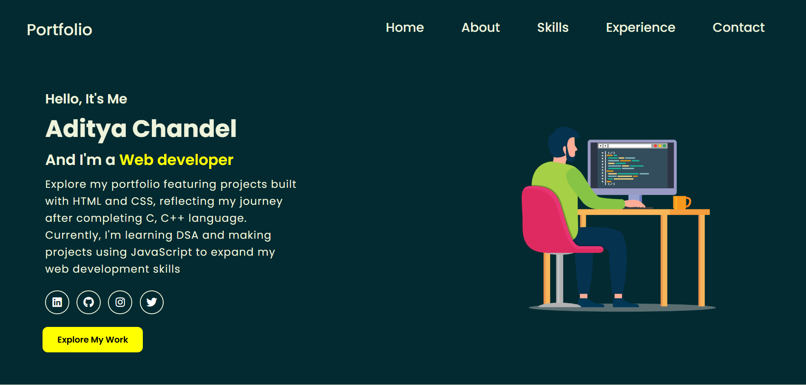

# Portfolio Website

This is a personal portfolio website showcasing my skills, experience, and projects as a CS student. The website is built using HTML, CSS, JavaScript, and Font Awesome for icons. It is fully responsive and optimized for all devices, ensuring a seamless user experience on desktops, tablets, and mobile phones. JavaScript animations have been implemented to enhance the interactivity and visual appeal of the website.

## Features

- **Responsive Design**: The website is designed to adapt to all screen sizes, providing a consistent experience across devices.
- **Smooth Animations**: JavaScript animations add interactivity and improve the user experience.
- **Home Section**: Introduction and brief overview of my background and goals.
- **About Section**: Detailed description of my journey, education, and personal interests.
- **Skills Section**: Tools and technologies I have proficiency in.
- **Experience Section**: Highlights of my projects and work experience.
- **Contact Section**: A form to send a message or project collaboration requests.

## Demo

You can view the live demo of this project here: [Portfolio Website](https://tonystark-19.github.io/Portfolio-Website/)

## Screenshots

### Home Section

## Built With

- **HTML5**: For the structure and content of the website.
- **CSS3**: For styling and layout.
- **JavaScript**: For animations and interactivity.
- **Font Awesome**: For icons in the navigation bar, social links, and project links.
- **Responsive Design Principles**: Media queries and flexible layouts are used to make the website mobile-friendly.

## Acknowledgments

- **Inspiration**: This portfolio website is inspired by various online portfolio designs and tutorials, combining different elements to create a unique personal showcase.
- **Resources**: Icons used in this project are provided by [Font Awesome](https://fontawesome.com/), a popular icon toolkit used to enhance the visual aspects of the website.

## Contributing

Feel free to fork this repository and customize it to create your own personal portfolio. I encourage others to build upon this project and make it their own by adding unique styles, content, and functionality.

---
**Author**: Aditya Chandel
